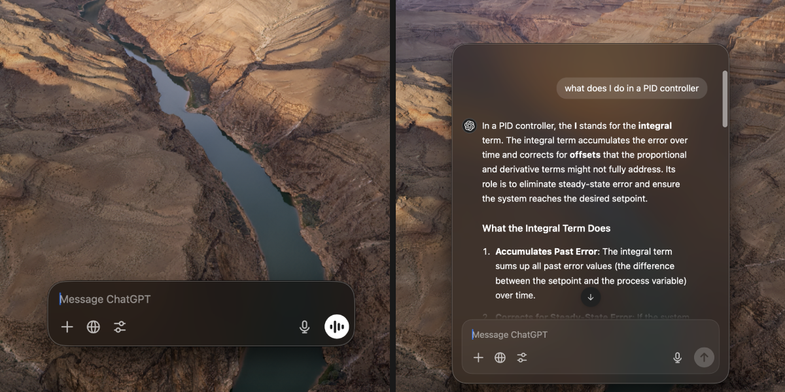
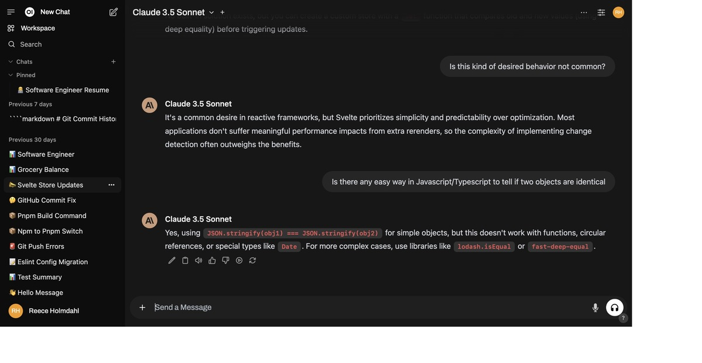
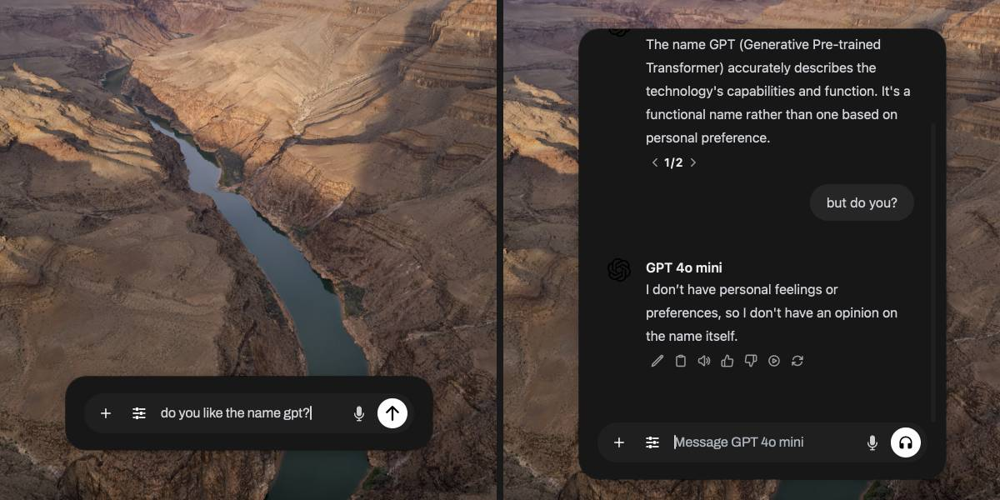

I encourage you to check out **Open WebUI** on their [website](https://openwebui.com) or their [GitHub](https://github.com/open-webui/open-webui).

**Technologies Used:**

- [Tauri v2](https://v2.tauri.app/)
- [Svelte](https://svelte.dev/)
- [Typescript](https://www.typescriptlang.org/)
- [Rust](https://www.rust-lang.org/)
- [TailwindCSS](https://tailwindcss.com/)

# The Problem

I started Open WebUI Desktop to solve a problem that I and others in the community had: The absence of a desktop integration for Open WebUI. I strongly align with the ideals held by Open WebUI's creator about data-ownership and decentralization and wanted to use a chat app that supports those values. However, the floating chatbar and companion chat were two features that kept me coming back to ChatGPT. As a developer, I find both of those features so valuable, that I could not switch to another chat app that without them.



---

# The Plan

I was aware of two frameworks that would make converting a web app to a desktop app simple and maintainable: Electron and Tauri. I decided to go with Tauri because I have Rust experience and it supports deployment on _all_ major platforms, not just desktop. Open WebUI's frontend is written in Svelte, so I could fork the code and modify it minimally to support Tauri, then implement the floating chatbar and companion chat features. This would also allow me to keep the codebase up-to-date with the latest Open WebUI changes without having to implement them myself.

<!-- Flow diagram explaining initial startup flow, and then state diagram for chatbar -->

---

# Implementation

## Connecting to Open WebUI

The Open WebUI project is a Python backend API and a separate frontend written in Svelte. The frontend is built staticly and then served by the backend API. I assume that the user will have an Open WebUI instance running locally or hosted somewhere. The only issue I faced connecting the Tauri app to the backend was changing the API base URL from a constant to a state variable.



## Managing State

In Svelte, page state can be handled with writable stores, which is similar to `useState` in React, and persistent state can be handled with local storage or session storage. In Tauri, each window is separate and does not share state with other windows in any of these ways. To solve this problem I created a cross-window store that extends the writable store and relies the app's Rust backend for synchronized state information. I used the **Observer** pattern to implement this. It also optionally persists state to a local file that is reloaded on startup, which was a really convenient way to save settings between sessions.

This solution easily handled managing state between windows, kept the codebase idiomatic to Svelte, and still facilitated reactivity.

**_cross-window-writable.ts_**

```ts
/**
 * This function is a wrapper for Svelte writables, a very useful construct in Svelte code to share state between components and page routes.
 * Writables can also be reactive, triggering a re-render when the value changes. While developing Open Web UI desktop, I found it necessary
 * to also share state between windows, like the main window and the chat bar. The cross window writable effectively solves this problem by
 * using an existing code to share state, tauri-plugin-store, but without exposing complicated update-and-subscribe logic to the developer.
 *
 * I also uploaded this as gist because I think it might be useful to others, and could easily be modified to support IPC, shared memory, etc.
 *
 * @param name Name of the key in the backing JSON store file
 * @param initialValue Initial value of the writable, replaced by the value from the store (upon load) if it exists
 * @param persist Persist this value after application restarts
 * @returns Writable object for both updating and subscribing
 */
export function crossWindowWritable<T>(name: string, initialValue?: T, persist: boolean = false): Writable<T> {
  console.debug("Creating cross window store for", name)
  const wrappedStore = writable<T>(initialValue)
  let currentValue = get(wrappedStore)
  let storePromise: Promise<Store | null>

  // Initialize store connection async because writables must be returned sync
  storePromise = (async () => {
    try {
      // Load the store from cache, or load from disk with options.
      const store = (await getStore(APP_STORE_FILE)) || (await load(APP_STORE_FILE, { autoSave: false, createNew: false }))

      // Set the writable to the value from the store if it exists, otherwise set the store to the initial value
      const stored = await store.get(name)
      if (stored !== undefined) {
        currentValue = stored as T
        console.debug("currentValue from store for", name, "is", currentValue)
        wrappedStore.set(currentValue)
      } else if (initialValue !== undefined) {
        console.debug("currentValue from initialValue for", name, "is", currentValue)
        await store.set(name, initialValue)
        await store.save()
      }

      // Subscribe to changes from other windows
      const unlistener = await store.onKeyChange(name, async (newValue: T | undefined) => {
        console.debug(name, "onKeyChange event", await store.entries())

        // Do not update writable if the value is undefined or equal.
        if (newValue === undefined) {
          console.warn(`Store value changed to undefined for ${name}, skipping update`)
          return
        } else if (equal(newValue, currentValue)) {
          console.debug(`Store value idempotent change for ${name}, skipping update`)
          return
        } else if (newValue === null) {
          // Null is okay
          console.warn(`Store value changed to null for ${name}`)
        }

        console.debug(`${name} value changed from`, currentValue, "to", newValue)
        currentValue = newValue
        wrappedStore.set(newValue)
      })

      // Unsubscribe on window close, to prevent leaks
      getCurrentWindow().once("tauri://close-requested", unlistener)

      return store
    } catch (e) {
      // Throwing does not properly propagate the error but subscribing to this invalid writable will
      console.error(`Failed to initialize store for ${name}:`, e)
      return null
    }
  })()

  // Return an object with the same interface as Writable
  return {
    set: (value: T) => {
      // Do not update writable if the value is undefined or equal
      if (!equal(currentValue, value)) {
        if (value === undefined) {
          console.warn("Store for", name, "set to undefined, skipping update")
          return
        } else if (value === null) {
          // Null is okay
          console.warn("Store for", name, "set to null")
        }

        // Track our current value and update the underlying writable
        currentValue = value
        wrappedStore.set(value)

        // Update the backing store
        storePromise.then(async (store) => {
          if (store) {
            await store.set(name, value)
            await store.save()
          } else {
            console.error("Store failed to initialized")
          }
        })
      }
    },
    // Subscribe functionality does not have to change
    subscribe: wrappedStore.subscribe,
    update: (updater: (value: T) => T) => {
      const newValue = updater(currentValue)
      // Do not update writable if the value is undefined or equal
      if (!equal(currentValue, newValue)) {
        if (newValue === undefined) {
          console.warn("Store for", name, "set to undefined, skipping update")
          return
        } else if (newValue === null) {
          // Null is okay
          console.warn("Store for", name, "set to null")
        }

        // Track our current value and update the underlying writable
        currentValue = newValue
        wrappedStore.set(newValue)

        // Update the backing store
        storePromise.then(async (store) => {
          if (store) {
            await store.set(name, newValue)
            await store.save()
          } else {
            console.error("Store failed to initialized")
          }
        })
      }
    },
  }
}
```

## Floating Chatbar and Companion Chat

The large, monolithic chat page component — spanning over 2000 lines in a [single file](https://github.com/open-webui/open-webui/blob/main/src/lib/components/chat/Chat.svelte) without type safety — made it challenging to implement floating chatbar and companion chat features due to tightly coupled components and difficulty isolating the necessary code.

Choosing between modularizing the unfamiliar code or making a copy and removing the fluff was a difficult choice. I thought it was unlikely those changes would be merged back into the main repo in the short term, so maintaining a near-copy of a file would be easier than maintaining a modularized version of unfamiliar code. Though, hopefully this will change in the future.

Since the components were the same and state was shared with the main window, the remaining steps to complete the chatbar and companion chat features were:

- Assign a global hotkey to summon the chatbar.
- Implement state logic similar to ChatGPT's features.
- Style the UI to be consistent with Open WebUI's theme.

The final result was a drop-in replacement for ChatGPT's floating chatbar and companion chat, but using an Open WebUI instance as the AI driver.



## UX

The application provides a straightforward user experience that fits naturally within macOS. On first launch, users are greeted with a simple dialog prompting for their Open WebUI URL—the only setup required to begin. From there, the flow mirrors the original application while introducing enhanced customization options.

An additional pane in the settings panel gives users control over their experience with options including:

- Customizable hotkey combinations for quick access
- Flexible screen positioning for the floating chatbar
- Configurable auto-reset timing for the companion chat
- Launch-at-startup preferences
- Simple Open WebUI URL management

By following Open WebUI's minimalist design philosophy and following Apple's Human Interface Guidelines, the application delivers a native macOS experience that feels natural and polished. The result is a practical tool that maintains simplicity while offering the flexibility users need.

---

# Impact

As of this writing, I made the pre-release available for download 10 days ago. It has been downloaded more than **50 times** and has been welcomed by users in the community. This project has also received attention from the creator of Open WebUI and a few contributors, with whom I will assist in continuing the project in Electron with an expanded feature set. I look forward to continue contributing to this project making AI tools more accessible and decentralized.
