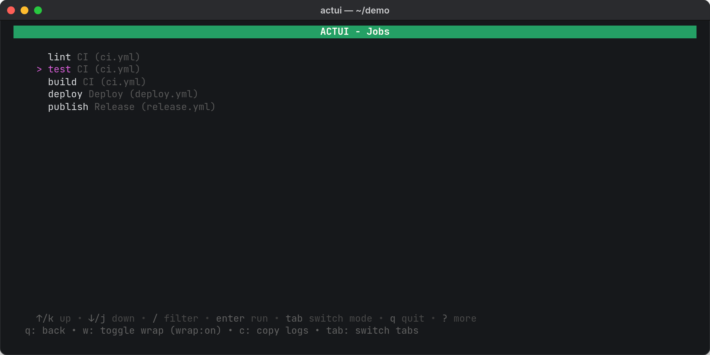

actui is a terminal UI for [act](https://github.com/nektos/act), the tool that runs GitHub Actions workflows on your own machine in Docker. act does the hard part, but its interface is a command line and one stream of logs. actui puts a menu in front of it: pick a workflow, job, or event, check the inputs and secrets, and watch the run split into one tab per job, with steps you can expand and collapse the way you would on GitHub.

I built it in an evening in February 2026 because I use act to debug CI pipelines before pushing them, and I was tired of two things: remembering the flags for every run, and reading the interleaved output of parallel jobs. It's a single Go program built on [Bubble Tea](https://github.com/charmbracelet/bubbletea), released as v0.1.0 with a Homebrew tap and Linux packages.

```sh
brew install reecelikesramen/tap/actui
# or
go install github.com/reecelikesramen/actui@latest
```

Run `actui` in any repository with a `.github/workflows` folder, or point it at another folder with `-W`. It needs act and Docker installed.

**Technologies Used:**

- [Go](https://go.dev/)
- [Bubble Tea](https://github.com/charmbracelet/bubbletea), [Bubbles](https://github.com/charmbracelet/bubbles), and [Lip Gloss](https://github.com/charmbracelet/lipgloss)
- [bubblezone](https://github.com/lrstanley/bubblezone) for mouse support
- [act](https://github.com/nektos/act) and Docker
- [GoReleaser](https://goreleaser.com/)

---

## Picking what to run

actui asks act for the list of jobs in the repository and shows it three ways: by workflow file, by job, and by event. Tab switches between them, and `/` filters the list.



## Setting up the run

Choosing something opens a run configuration screen instead of starting right away. actui reads the workflow file to fill it in: `workflow_dispatch` inputs with their defaults, every secret the workflow references, and the workflow's `env` values. You can change the event, switch the container architecture between amd64 and arm64, and turn on act's artifact server. Secrets are masked once entered. actui then builds the act command with the right `-j`, `-W`, `--input`, `--secret`, and `--env` flags, so you don't have to.


## Watching it run

act prefixes every log line with the job it came from. actui uses that prefix to split the output into a tab per job. Inside a tab, each step gets a status icon and its own collapsible section, the running step stays open, and the steps that haven't started yet are listed from the workflow file as pending.


When a step fails, it opens automatically and the steps that never ran are shown as cancelled, like in the cover image above. The Overview tab shows every job's status and the full, unsplit log. Clicking a step toggles it, `w` toggles line wrapping, `c` copies the current tab's logs to the clipboard, and `q` stops the run.


---

The screenshots on this page are real actui runs against a small demo repository, captured from the terminal. The source is on [GitHub](https://github.com/reecelikesramen/actui).
