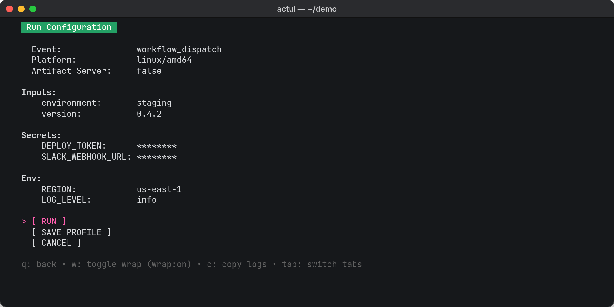
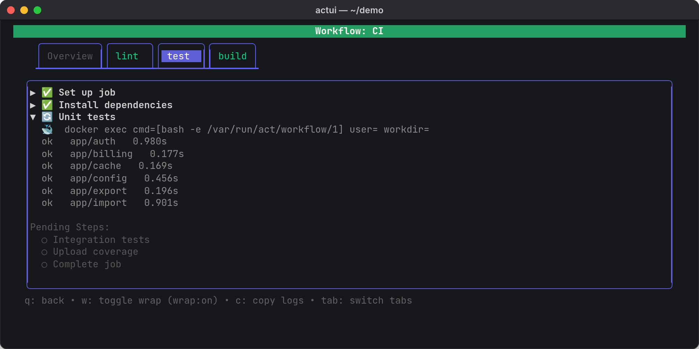
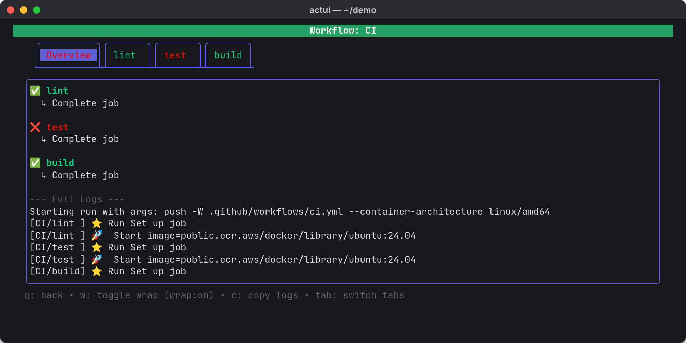

actui is a terminal UI for [act](https://github.com/nektos/act), the tool that runs GitHub Actions workflows locally in Docker. You pick a workflow, job, or event from a menu, check its inputs and secrets, and watch the run split into a tab per job with collapsible steps, like the Actions page on GitHub.

It's a single Go program built on [Bubble Tea](https://github.com/charmbracelet/bubbletea). I built it in February 2026 and released v0.1.0 with a Homebrew tap and Linux packages.

```sh
brew install reecelikesramen/tap/actui
# or
go install github.com/reecelikesramen/actui@latest
```

**Technologies Used:**

- [Go](https://go.dev/)
- [Bubble Tea](https://github.com/charmbracelet/bubbletea), [Bubbles](https://github.com/charmbracelet/bubbles), and [Lip Gloss](https://github.com/charmbracelet/lipgloss)
- [bubblezone](https://github.com/lrstanley/bubblezone) for mouse support
- [act](https://github.com/nektos/act) and Docker
- [GoReleaser](https://goreleaser.com/)

---

# The Problem

I build a lot of CI/CD pipelines, and act is how I test them without pushing a commit and waiting on a runner. act is great at running workflows. It's not great to use. Every run means remembering the right mix of `-j`, `-W`, `--input`, `--secret`, and `--env` flags, and when jobs run in parallel their logs all land in one interleaved stream. Finding the step that failed means scrolling back through all of it.

I didn't want to replace act. I wanted a front end for it that makes a local run feel like reading a run on GitHub.

---

# How It Works

## Setting up a run

actui asks act for the repository's jobs and lists them by workflow file, by job, or by event. Picking one opens a run configuration screen instead of starting right away. actui reads the workflow file to fill it in: `workflow_dispatch` inputs with their defaults, every secret the workflow references, and the workflow's `env` values. You can also change the event, switch between amd64 and arm64 containers, and turn on act's artifact server. When you hit run, actui builds the act command from those settings.



## Splitting the logs

act prefixes every log line with the job it came from, like `[CI/test]`. actui reads act's output as it streams, uses that prefix to route each line to its job's tab, and watches for act's step markers to start, finish, or fail a step. It also parses the workflow file up front, so steps that haven't started yet show as pending instead of just not being there.



When a step fails, it opens automatically, and the steps that never ran are struck through, like in the cover image above. The Overview tab keeps every job's status and the full log in one place. You can click a step to expand it, copy a tab's logs, or stop the run.



---

# Where It Stands

actui does what I built it for, but it has one weak spot: it reads act's human-readable output. Step status comes from matching act's text and emoji markers, and v0.1.0 shipped with a fix for a case where a failed job showed up with a green check. act also has a `--json` log format, and switching to it would make actui hold up across act versions. Saving run configurations as profiles isn't implemented yet; the button is there, but it doesn't save anything.

The screenshots on this page are real actui runs against a small demo repository. The source is on [GitHub](https://github.com/reecelikesramen/actui).
