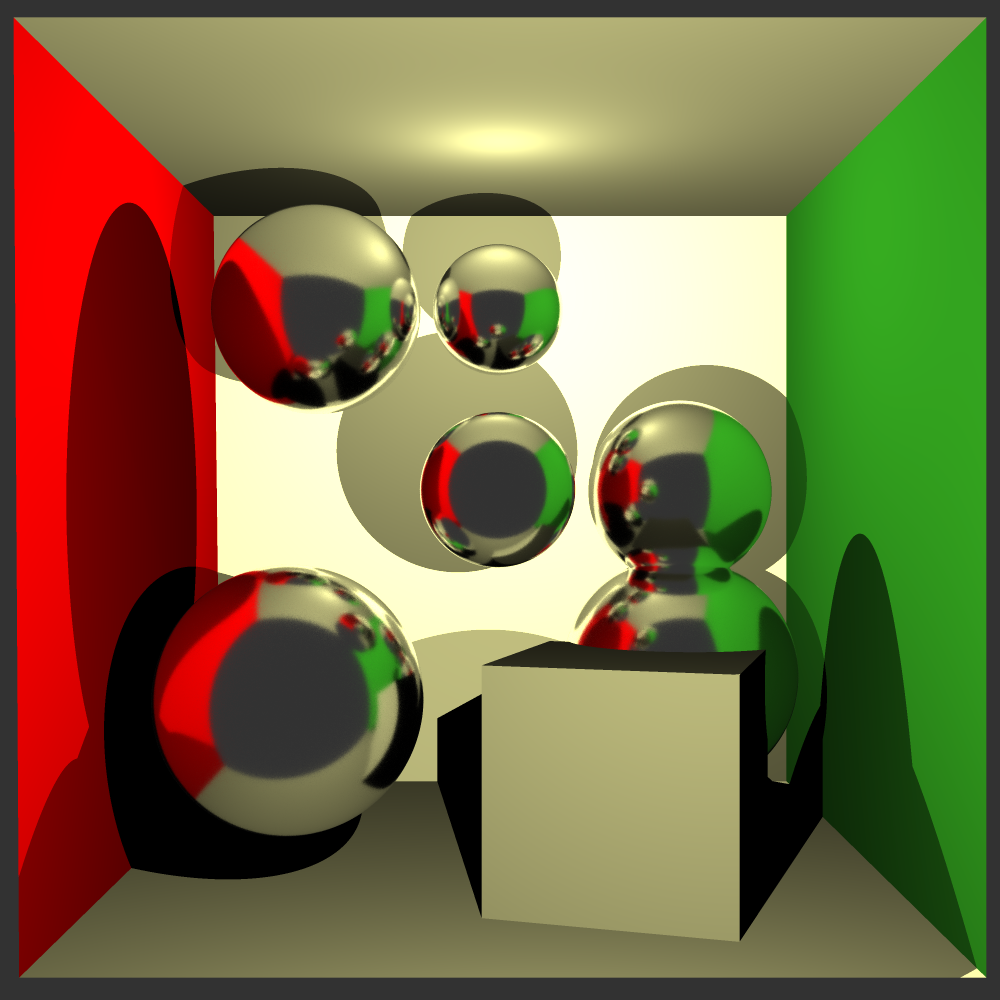
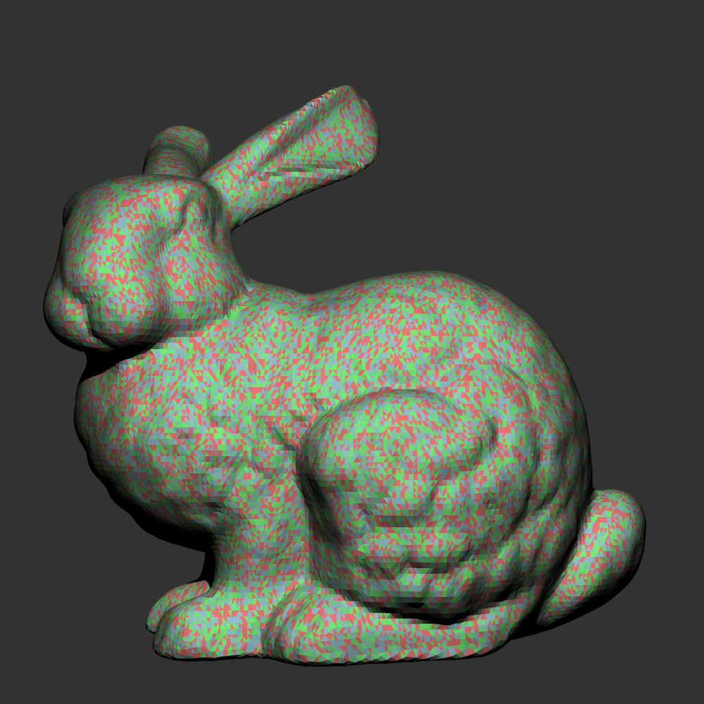

WebTracer is a ray tracer I wrote in Rust and compiled to WebAssembly. The same engine renders from the command line or in a browser tab, where a small app wraps it with a JSON scene editor, a live preview, and an asset manager for models and textures.

I built it in November and December 2024 to learn Rust. The engine is on [GitHub](https://github.com/reecelikesramen/rust-raytracer), and the browser app is on this site's [`raytracer-project` branch](https://github.com/reecelikesramen/holmdahl.io/tree/raytracer-project).

```sh
cargo build -p raytracer-cli --release
```

**Technologies Used:**

- [Rust](https://www.rust-lang.org/) and [nalgebra](https://nalgebra.rs/)
- [Rayon](https://docs.rs/rayon/) and [wasm-bindgen-rayon](https://github.com/RReverser/wasm-bindgen-rayon)
- [WebAssembly](https://webassembly.org/) with [wasm-bindgen](https://github.com/rustwasm/wasm-bindgen)
- [wgpu](https://wgpu.rs/) (WebGPU)
- [Preact](https://preactjs.com/), [TypeScript](https://www.typescriptlang.org/), and [Vite](https://vite.dev/)
- [CodeMirror](https://codemirror.net/) and [Dexie](https://dexie.org/) (IndexedDB)


---

# The Problem

I'd already written a ray tracer in C++ for my computer graphics course, and I wanted to learn Rust. Rewriting something I understood meant I could spend my time on the language (ownership, lifetimes, traits, `Send` and `Sync`) instead of the math.

I also wanted to know whether it could run in a browser without being painfully slow. A ray tracer is almost all CPU-bound math that splits cleanly across cores, which is exactly what WebAssembly and threads should be good at.

---

# How It Works

## One engine, two front ends

The project is three crates: the engine as a library, a command-line tool, and a WebAssembly binding. The library parses a JSON scene, builds the geometry, and traces rays. It never touches the file system. The front end hands it the bytes for any meshes and textures the scene needs, so the CLI reads them from disk and the browser fetches them.

Scenes can have spheres, triangles, quads, boxes, OBJ meshes, and instanced models with their own transforms. Materials follow [Ray Tracing in One Weekend](https://raytracing.github.io/): diffuse surfaces, metals, glass that reflects or refracts using Schlick's approximation, and emissive lights. Cameras support depth of field.



## Making it fast

The first big win was a bounding volume hierarchy. Before it, every ray tested every triangle in the scene. Rendering the Stanford bunny went from 13 minutes to 17 seconds.



The second was running on every core with Rayon. I tried splitting the image by pixel, by row, and by column; columns were slightly faster than the others, and one scene went from 179 seconds to 37.

The CPU path is written to be cache-friendly and SIMD-friendly, and GPU acceleration runs through wgpu, which targets WebGPU in the browser.

## Threads in the browser

WebAssembly doesn't get threads for free. [wasm-bindgen-rayon](https://github.com/RReverser/wasm-bindgen-rayon) runs Rayon's thread pool on Web Workers that share one block of WebAssembly memory. That meant building with shared memory turned on and serving the page with the cross-origin isolation headers browsers require before they allow it.

It still didn't work until I found that the framebuffer's lock, from the `parking_lot` crate, isn't supported in WebAssembly. Switching to the standard library's `RwLock` fixed it, and the full render in the browser got much faster.

The browser has two render modes. The preview renders a batch of pixels per animation frame and adjusts the batch size after every frame to hold about 8 frames per second, so the page stays responsive while the image fills in. The full render runs in a Web Worker on the thread pool, draws to an offscreen canvas, and hands the finished image back to the page to show and save.

## The browser app

The app around the engine is a Preact app with four panes: a list of scenes, a JSON editor with linting, the live preview, and an asset manager for models and textures. Scenes and assets are stored in the browser with IndexedDB, so they survive a reload, and deleting a scene can be undone for a few seconds. When a scene references a model or texture, the app loads its bytes and passes them into the engine.

---

# Where It Stands

I haven't worked on it since January 2025, and the browser app never shipped. It lives on a branch of the old version of this site and wasn't carried over when I rebuilt the site in Astro. The engine is in good shape, but by my own last commit the WebAssembly layer was messy and due for a refactor. The next things on my list were more materials and light types.

The scenes in these renders were created by Dr. Pete Willemsen at the University of Minnesota Duluth.
